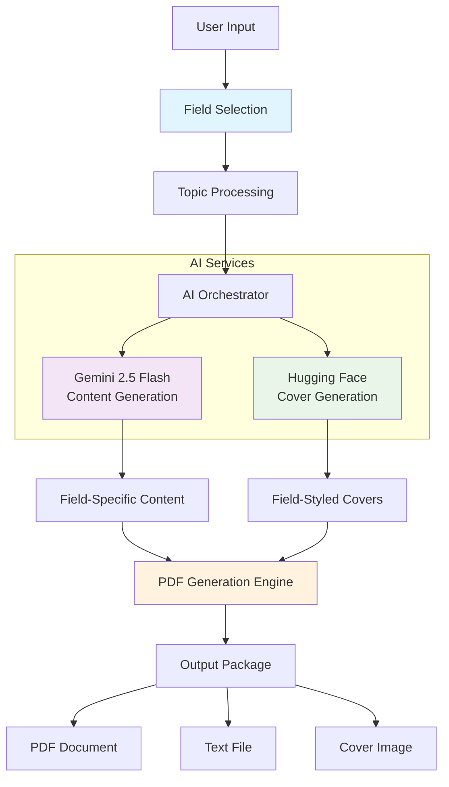

# 📚 KiddoBookAI - AI-Powered Book Generator with Field-Specific Content & Covers

<div align="center">


**Transform topics into professional field-specific books with AI-generated covers**

[Features](#-features) • [Live Demo](#-live-demo) • [Installation](#-installation) • [Field Support](#-field-support) • [Architecture](#-architecture) • [Usage](#-usage)

</div>

## 🎯 Overview

KiddoBookAI is an advanced book generation platform that creates **field-specific educational books** with **AI-generated covers**. Leveraging Google Gemini AI for content generation and Hugging Face models for cover art, it produces professional PDF books tailored to specific academic and professional fields.

## ✨ Key Features

### 🚀 Core Capabilities
- **Field-Specific Content**: 12 academic fields with customized prompts
- **AI-Generated Covers**: Hugging Face FLUX/Stable Diffusion integration
- **Multiple Book Styles**: 5 book formats with field-appropriate structures
- **Smart Prompt Engineering**: Domain-specific content generation
- **Professional PDF Export**: Branded documents with field-specific styling
- **Real-Time Generation**: Progress tracking with visual feedback

### 🎨 Field-Specific Customization
Each field includes:
- **Custom Image Prompts**: Tailored cover art generation
- **Specialized Text Prompts**: Field-appropriate content focus
- **Color Schemes**: Themed visual styling
- **Icons**: Visual field representation

### 📁 Supported Outputs
- **PDF Documents**: Professionally formatted with covers
- **Text Files**: Raw content for editing
- **Cover Images**: AI-generated field-specific artwork
- **Complete Packages**: All assets bundled together

## 🏗️ Architecture



## 📚 Field Support

### 12 Academic & Professional Fields

| Field | Icon | Color | Specialization |
|-------|------|-------|---------------|
| **Computer Science** | 💻 | `#2563EB` | Algorithms, programming, computational thinking |
| **Mathematics** | 🧮 | `#DC2626` | Logical reasoning, problem-solving |
| **Science** | 🔬 | `#059669` | Scientific method, experiments |
| **History** | 📜 | `#D97706` | Historical context, timelines |
| **Literature** | 📖 | `#7C3AED` | Narrative analysis, literary devices |
| **Art & Design** | 🎨 | `#DB2777` | Creative expression, design principles |
| **Business & Economics** | 💼 | `#0891B2` | Practical applications, case studies |
| **Health & Medicine** | ⚕️ | `#65A30D` | Health education, medical knowledge |
| **Engineering** | ⚙️ | `#475569` | Engineering principles, problem-solving |
| **Psychology** | 🧠 | `#C026D3` | Human behavior, cognitive processes |
| **Languages** | 🗣️ | `#EA580C` | Language acquisition, communication |
| **General Education** | 🎓 | `#4F46E5` | Comprehensive learning, critical thinking |

### Book Styles & Structures

| Style | Structure | Tone | Best For |
|-------|-----------|------|----------|
| **Textbook** | Learning Objectives, Key Terms, Examples | Academic, formal | Classroom instruction |
| **Exam-prep Notes** | Quick Definitions, Memory Tricks, Common Questions | Concise, practical | Test preparation |
| **Story-style Guide** | Story Introduction, Real-world Analogies | Narrative, engaging | Creative learning |
| **Research Manual** | Methodologies, Case Studies, References | Technical, precise | Academic research |
| **Beginner's Handbook** | Step-by-Step Guides, Hands-on Exercises | Friendly, simple | New learners |

## 🛠️ Technology Stack

| Component | Technology | Purpose |
|-----------|------------|---------|
| **Frontend** | Streamlit 1.31+ | Interactive web interface |
| **Content AI** | Google Gemini 2.5 Flash | Field-specific content generation |
| **Cover AI** | Hugging Face FLUX/Stable Diffusion | AI-generated book covers |
| **PDF Generation** | ReportLab 4.0+ | Professional document creation |
| **Image Processing** | Pillow 10.2+ | Image handling and manipulation |
| **API Integration** | Requests 2.31+ | External service communication |

## 📦 Installation

### Prerequisites
- Python 3.8 or higher
- Google AI Studio API key ([Get free key](https://makersuite.google.com/app/apikey))
- Hugging Face API token ([Get token](https://huggingface.co/settings/tokens))
- Git (for cloning)

### Step-by-Step Setup

```bash
# 1. Clone the repository
git clone https://github.com/yourusername/kiddobookai.git
cd kiddobookai

# 2. Create virtual environment
python -m venv venv

# 3. Activate virtual environment
# Windows:
venv\Scripts\activate
# macOS/Linux:
source venv/bin/activate

# 4. Install dependencies
pip install -r requirements.txt

# 5. Configure API keys
# Option A: Set environment variables
export GOOGLE_API_KEY="your-gemini-api-key"
export HF_TOKEN="your-huggingface-token"

# Option B: Create .env file
echo "GOOGLE_API_KEY=your-gemini-api-key" > .env
echo "HF_TOKEN=your-huggingface-token" >> .env

# 6. Run the application
streamlit run app.py
```

### Requirements File
```txt
streamlit==1.31.0
google-generativeai==0.3.2
reportlab==4.0.7
Pillow==10.2.0
requests==2.31.0
python-dotenv==1.0.0
```

## 🚀 Quick Start Guide

### 1. **Select Your Field**
```python
# Choose from 12 academic/professional fields
# Each field provides specialized:
# - Content prompts
# - Cover art styles
# - Color schemes
# - Iconography
```

### 2. **Configure Your Book**
```python
# Input parameters:
# - Book Title: e.g., "Advanced Python Programming"
# - Description: Optional context for AI
# - Book Style: Textbook, Exam-prep, etc.
# - Topics: List your chapters/subjects
```

### 3. **Generate with AI**
```python
# Two-stage AI generation:
# 1. Content Generation (Gemini AI):
#    - Field-specific chapters
#    - Appropriate structure and tone
#    - Practical examples
#
# 2. Cover Generation (Hugging Face):
#    - Field-themed artwork
#    - Title integration
#    - Professional book cover design
```

### 4. **Export & Download**
```python
# Multiple export options:
# - Complete PDF with cover
# - Text-only version
# - Standalone cover image
# - All assets bundled
```

## 🎯 API Integration Details

### Google Gemini AI Configuration
```python
import google.generativeai as genai

# Configure API
genai.configure(api_key=os.getenv("GOOGLE_API_KEY"))
model = genai.GenerativeModel("gemini-2.5-flash")

# Field-specific prompt generation
def generate_field_specific_text_prompt(topic, book_type, field):
    field_config = FIELD_CONFIGS.get(field)
    return f"""Write a chapter on "{topic}" for {field}...
    {field_config['text_prompt_prefix']}
    Focus on: {field_config.get('focus_areas', [])}"""
```

### Hugging Face Cover Generation
```python
def generate_field_specific_image_prompt(field, book_name, book_type):
    field_config = FIELD_CONFIGS.get(field)
    prompt = f"Professional book cover for {field}, {field_config['image_prompt']}"
    prompt += f", {book_name}, {book_type} style"
    return prompt
```

## 📊 Performance & Limits

| Metric | Value | Notes |
|--------|-------|-------|
| Content Generation | ~15-20 sec/chapter | Gemini 2.5 Flash |
| Cover Generation | ~30-60 seconds | Hugging Face API |
| PDF Generation | ~3-5 seconds | ReportLab processing |
| Max Topics | Unlimited | Batched processing |
| File Size | ~150KB/chapter | Efficient PDF compression |
| Image Quality | 512x512 px | High-quality covers |

## 🔧 Advanced Configuration

### Custom Field Configuration
```python
# Add new fields in FIELD_CONFIGS
"Your Field": {
    "image_prompt": "custom style description",
    "text_prompt_prefix": "Custom focus area...",
    "color_scheme": "#HEXCODE",
    "icon": "🔧",
    "focus_areas": ["Area 1", "Area 2"]
}
```

### Book Type Customization
```python
# Modify BOOK_TYPE_CONFIGS
"Custom Book Type": {
    "structure": "Your custom structure",
    "tone": "Your preferred tone",
    "additional_params": {}
}
```

### Environment Variables
```bash
# Required
GOOGLE_API_KEY=your_gemini_api_key_here
HF_TOKEN=your_huggingface_token_here

# Optional
STREAMLIT_SERVER_PORT=8501
STREAMLIT_SERVER_ADDRESS=0.0.0.0
LOG_LEVEL=INFO
```

## 🌐 Deployment Options

### Option 1: Streamlit Cloud (Recommended)
```yaml
# Streamlit Community Cloud (Free)
# Features: Auto-deploy from GitHub, secrets management
# Steps:
# 1. Push to GitHub repository
# 2. Connect at share.streamlit.io
# 3. Add secrets: GOOGLE_API_KEY, HF_TOKEN
# 4. Deploy with one click
```

### Option 2: Hugging Face Spaces
```yaml
# Hugging Face Spaces (Free)
# Features: GPU support, custom Docker
# Steps:
# 1. Create new Space
# 2. Select Streamlit SDK
# 3. Add secrets in Settings
# 4. Push your code
```

### Option 3: Self-Hosted Docker
```dockerfile
# Dockerfile
FROM python:3.9-slim
WORKDIR /app
COPY requirements.txt .
RUN pip install -r requirements.txt
COPY . .
EXPOSE 8501
CMD ["streamlit", "run", "app.py", "--server.port=8501"]
```

## 🔐 Security & Best Practices

### API Security
```python
# Never hardcode API keys
# Use environment variables
import os
api_key = os.getenv("GOOGLE_API_KEY")  # Secure method

# Validate keys on startup
if not api_key:
    st.error("API key not configured")
    st.stop()
```

### Input Sanitization
```python
def clean_topics(raw_text: str) -> list[str]:
    """Sanitize and normalize user input"""
    topics = []
    lines = raw_text.split("\n")
    for line in lines:
        # Remove special characters and normalize
        line = re.sub(r"[^\w\s,.-]", "", line.strip())
        if line:
            topics.append(line)
    return topics
```

### Rate Limiting
```python
# Implement delays for API calls
import time

def safe_api_call(api_function, *args, **kwargs):
    result = api_function(*args, **kwargs)
    time.sleep(1)  # Prevent rate limiting
    return result
```

## 📈 Future Roadmap

### Planned Features
- [ ] **Multi-language Support**: Generate books in different languages
- [ ] **Advanced Cover Customization**: More control over cover generation
- [ ] **Template Library**: Pre-designed templates for each field
- [ ] **Collaboration Features**: Team-based book creation
- [ ] **Export Formats**: EPUB, MOBI, DOCX support
- [ ] **Audio Books**: Text-to-speech integration
- [ ] **Analytics Dashboard**: Usage statistics and insights

### Technical Improvements
- [ ] **Caching System**: Faster regeneration of content
- [ ] **Batch Processing**: Generate multiple books simultaneously
- [ ] **Database Integration**: Save and manage book projects
- [ ] **User Accounts**: Personal libraries and history
- [ ] **API Versioning**: Stable external API

## 🤝 Contributing

We welcome contributions from the community! Here's how you can help:

### Development Setup
```bash
# 1. Fork the repository
# 2. Clone your fork
git clone https://github.com/your-username/kiddobookai.git
cd kiddobookai

# 3. Create development branch
git checkout -b feature/your-feature

# 4. Install development dependencies
pip install -r requirements-dev.txt

# 5. Make your changes and test
pytest tests/

# 6. Commit and push
git commit -m "Add: your feature description"
git push origin feature/your-feature

# 7. Open a Pull Request
```

### Contribution Areas
- **New Fields**: Add support for additional academic fields
- **Cover Models**: Integrate new AI image generation models
- **UI/UX Improvements**: Enhance the user interface
- **Documentation**: Improve guides and examples
- **Testing**: Add unit and integration tests
- **Performance**: Optimize generation speed

## 📄 License

This project is licensed under the MIT License - see the [LICENSE](LICENSE) file for details.

```
MIT License

Copyright (c) 2024 KiddoBookAI

Permission is hereby granted, free of charge, to any person obtaining a copy
of this software and associated documentation files (the "Software"), to deal
in the Software without restriction, including without limitation the rights
to use, copy, modify, merge, publish, distribute, sublicense, and/or sell
copies of the Software, and to permit persons to whom the Software is
furnished to do so, subject to the following conditions:

The above copyright notice and this permission notice shall be included in all
copies or substantial portions of the Software.
```

## 🙏 Acknowledgments

- **Google Gemini AI** - For advanced language model capabilities
- **Hugging Face** - For AI model hosting and inference APIs
- **Streamlit** - For the incredible web app framework
- **ReportLab** - For robust PDF generation
- **Open Source Community** - For continuous inspiration and support

## 📞 Support & Resources

### Documentation
- [Full Documentation](docs/) - Detailed usage guides
- [API Reference](docs/api.md) - Technical specifications
- [Field Guides](docs/fields/) - Field-specific best practices
- [FAQ](docs/faq.md) - Common questions and solutions

### Community & Support
- [GitHub Issues](https://github.com/yourusername/kiddobookai/issues) - Bug reports and feature requests
- [Discussions](https://github.com/yourusername/kiddobookai/discussions) - Community forum
- [Email Support](mailto:support@kiddobookai.com) - Direct assistance

### Learning Resources
- [Tutorial Videos](https://youtube.com/playlist?list=...) - Step-by-step guides
- [Example Books](examples/) - Sample generated books
- [Blog](https://blog.kiddobookai.com) - Updates and tips

## 🚀 Quick Commands Reference

```bash
# Development
streamlit run app.py                    # Run locally
streamlit run app.py --server.port 8080 # Custom port
python -m pytest tests/                 # Run tests

# Production
docker build -t kiddobookai .           # Build Docker image
docker run -p 8501:8501 kiddobookai     # Run container

# Maintenance
python scripts/cleanup.py               # Clean generated files
python scripts/backup.py                # Backup configurations
```

## 📖 Example Use Cases

### Educational Institutions
- **Custom Textbooks**: Create field-specific course materials
- **Study Guides**: Generate exam preparation materials
- **Research Compilations**: Compile papers into handbooks
- **Departmental Resources**: Field-specific reference materials

### Corporate Training
- **Onboarding Manuals**: Company and role-specific guides
- **Process Documentation**: Standard operating procedures
- **Training Materials**: Skill development resources
- **Knowledge Bases**: Internal reference libraries

### Content Creators
- **E-books**: Convert blog series into structured books
- **Course Materials**: Create accompanying resources
- **Tutorial Series**: Step-by-step learning guides
- **Portfolio Pieces**: Showcase expertise through books

### Personal Projects
- **Learning Journals**: Document personal learning journeys
- **Family Histories**: Create narrative family books
- **Recipe Collections**: Themed cookbooks with instructions
- **Hobby Guides**: Comprehensive guides for personal interests

---

<div align="center">

## 🎉 Get Started Today!

**Ready to create your first field-specific AI-generated book?**

1. **Choose your field** from 12 specialized options
2. **Configure your book** with custom details
3. **Generate with AI** for content and covers
4. **Download professionally** formatted outputs

**Transform your knowledge into beautifully crafted books!** 📚✨

[](https://share.streamlit.io/deploy)
[](https://huggingface.co/spaces)

</div>

---

<div align="center">

**Built with ❤️ by the KiddoBookAI Team**

*Empowering education through AI-powered book creation*

[](https://github.com/yourusername/kiddobookai/stargazers)
[](https://github.com/yourusername/kiddobookai/network/members)

</div>
