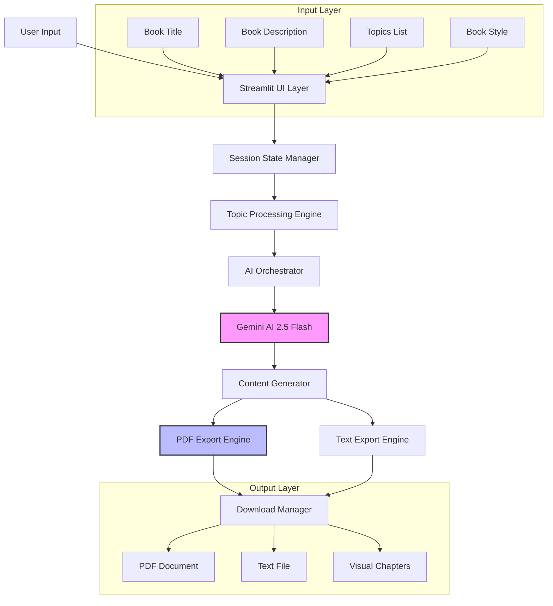

# 📚 KiddoBookAI - AI-Powered Book Generator

<div align="center">


**Transform Topics into Professional Books with AI**

[Live Demo](#live-demo) • [Features](#-features) • [Installation](#-installation) • [Architecture](#-architecture) • [Usage](#-usage)

</div>

## 🎯 Overview

KiddoBookAI is an intelligent book generation platform that transforms your topics into professionally formatted educational books using Google's Gemini AI. Whether you're creating textbooks, exam guides, story-based learning materials, or research manuals, KiddoBookAI automates the entire content creation process with AI-powered chapter generation and professional PDF export.

## ✨ Features

### 🚀 Core Capabilities
- **AI-Powered Content Generation**: Leverages Google Gemini 2.5 Flash for intelligent chapter creation
- **Multiple Book Styles**: 5 distinct book formats (Textbook, Exam-prep, Story-style, Research, Beginner's Handbook)
- **Professional PDF Export**: Generate branded PDFs with clean formatting
- **Topic-Based Chapter Creation**: Convert bullet points or comma-separated topics into full chapters
- **Real-Time Progress Tracking**: Visual progress bar during generation
- **Session State Management**: Preserves your work across interactions
- **Responsive UI**: Clean, modern interface with gradient styling

### 📁 Output Formats
- **PDF Documents**: Professionally formatted with headers and chapters
- **Text Files**: Raw text versions for easy editing
- **Branded Content**: All exports include KiddoBookAI branding
- **Chapter Organization**: Clear section breaks and numbering

### 🎨 Book Styles Available
| Style | Description | Best For |
|-------|-------------|----------|
| 📖 **Textbook** | Academic, structured content with examples | Formal education |
| 📝 **Exam-prep Notes** | Concise, practical study material | Test preparation |
| 📚 **Story-style Guide** | Narrative, engaging learning | Creative teaching |
| 🔬 **Research Manual** | Technical, data-driven content | Academic research |
| 🎯 **Beginner's Handbook** | Simple, step-by-step instructions | New learners |

## 🏗️ Architecture



### System Components

#### **1. Frontend Layer (Streamlit)**
- **Interactive UI**: Clean, responsive web interface
- **Real-time Updates**: Live progress tracking
- **State Management**: Session persistence across reruns
- **Export Interface**: Download buttons for multiple formats

#### **2. AI Processing Layer**
- **Gemini 2.5 Flash Integration**: State-of-the-art language model
- **Prompt Engineering**: Optimized prompts for each book style
- **Content Structuring**: Consistent chapter formatting
- **Error Handling**: Graceful fallbacks for API issues

#### **3. Data Processing Layer**
- **Topic Normalization**: Cleans and structures user input
- **Chapter Management**: Organizes content into logical sections
- **Format Conversion**: Transforms AI output into structured content

#### **4. Export Layer**
- **PDF Generation**: ReportLab-based professional formatting
- **Text Processing**: Clean text export with proper formatting
- **Brand Management**: Consistent KiddoBookAI branding

## 🛠️ Technology Stack

| Layer | Technology | Purpose |
|-------|------------|---------|
| **Frontend** | Streamlit 1.31+ | Interactive web interface |
| **AI Engine** | Google Gemini AI 2.5 Flash | Content generation |
| **PDF Generation** | ReportLab 4.0+ | Professional document creation |
| **Core Language** | Python 3.8+ | Backend processing |
| **Dependency Mgmt** | pip/requirements.txt | Package management |
| **Deployment** | Streamlit Cloud/Hugging Face | Hosting options |

## 📦 Installation

### Prerequisites
- Python 3.8 or higher
- Google AI Studio API key (free tier available)
- Git (for cloning)

### Step-by-Step Setup

```bash
# 1. Clone the repository
git clone https://github.com/yourusername/kiddobookai.git
cd kiddobookai

# 2. Create virtual environment (recommended)
python -m venv venv

# 3. Activate virtual environment
# Windows:
venv\Scripts\activate
# macOS/Linux:
source venv/bin/activate

# 4. Install dependencies
pip install -r requirements.txt

# 5. Configure API key
# Replace in app.py or set environment variable:
export GOOGLE_API_KEY="your-api-key-here"

# 6. Run the application
streamlit run app.py
```

### Requirements File
```txt
streamlit==1.31.0
google-generativeai==0.3.2
reportlab==4.0.7
Pillow==10.2.0
```

## 🚀 Usage Guide

### 1. **Setup Your Book**
```python
# The application provides an intuitive interface:
# 1. Enter book title and optional description
# 2. Select book style from 5 options
# 3. List topics (one per line or comma-separated)
```

### 2. **Generate Content**
```python
# Click "Generate Book" to:
# 1. Process and normalize topics
# 2. Generate chapters sequentially with AI
# 3. Show real-time progress
# 4. Display generated chapters in expandable sections
```

### 3. **Export Options**
```python
# After generation, download:
# 1. PDF Document - Professional formatting
# 2. Text File - Raw content for editing
# Both include KiddoBookAI branding
```

### 4. **Example Input**
```
Book Title: Python Programming Fundamentals
Book Style: Beginner's Handbook
Topics:
- Variables and Data Types
- Control Structures
- Functions and Modules
- File Handling
- Error Handling
```

## 🎯 API Integration

### Google Gemini AI Configuration
```python
import google.generativeai as genai

# Configure API
genai.configure(api_key=API_KEY)
model = genai.GenerativeModel("gemini-2.5-flash")

# Content generation prompt
prompt = f"""Write a chapter on "{topic}" for a {book_type.lower()}..."""
```

### Prompt Engineering Strategy
Each book style has optimized prompts for:
- **Structure**: Pre-defined chapter layouts
- **Tone**: Style-appropriate language
- **Depth**: Content complexity matching the style
- **Examples**: Relevant practical examples

## 📊 Performance Metrics

| Metric | Value | Notes |
|--------|-------|-------|
| Chapter Generation Time | ~10-15 seconds | Depends on topic complexity |
| PDF Generation Time | ~2-5 seconds | For 5-10 chapters |
| API Latency | < 3 seconds | Gemini 2.5 Flash response |
| Max Topics per Book | Unlimited | Batched processing |
| File Size (PDF) | ~100KB per chapter | Efficient compression |

## 🔧 Development

### Project Structure
```
kiddobookai/
├── app.py                    # Main application
├── requirements.txt          # Dependencies
├── README.md                 # This file
├── .gitignore               # Git ignore file
├── generated_books/         # Output directory (auto-created)
│   ├── *.pdf               # Generated PDFs
│   └── *.txt              # Generated text files
└── assets/                  # Optional: Screenshots, logos
```

### Key Functions
```python
# Core functionality
clean_topics()        # Normalizes user input
explain_topic()       # Generates chapter content
generate_pdf()        # Creates PDF document
# Session state management
# Real-time progress tracking
# Error handling and validation
```

### Extending the Application

#### Adding New Book Styles
```python
book_type_prompts = {
    "New Style": {
        "structure": "Your structure here",
        "tone": "Your tone description"
    }
}
```

#### Customizing PDF Templates
```python
def generate_pdf(book_text, book_name, book_type, filename):
    # Modify ReportLab canvas settings
    # Customize headers, footers, styling
    # Add custom branding elements
```

## 🌐 Deployment Options

### Option 1: Streamlit Cloud (Recommended)
```yaml
# Free tier includes:
# - 1GB RAM
# - 1 CPU core
# - Unlimited apps
# - Custom domains
```

**Deployment Steps:**
1. Push to GitHub
2. Connect at [share.streamlit.io](https://share.streamlit.io)
3. Configure API key as secrets
4. Deploy with one click

### Option 2: Hugging Face Spaces
```yaml
# Free features:
# - CPU/GPU options
# - Custom environments
# - Auto-deploy from Git
```

### Option 3: Self-Hosted
```bash
# Using Docker
docker build -t kiddobookai .
docker run -p 8501:8501 kiddobookai

# Using traditional hosting
# Configure reverse proxy with Nginx/Apache
```

## 🔐 Security & Best Practices

### API Key Management
```python
# NEVER commit API keys to version control
# Use environment variables
import os
API_KEY = os.getenv("GOOGLE_API_KEY")
```

### Input Validation
- Sanitize user inputs
- Limit topic length
- Validate book titles
- Handle special characters

### Rate Limiting
```python
# Implement if needed
import time
def rate_limited_generate():
    time.sleep(1)  # Delay between API calls
    return model.generate_content(prompt)
```

## 📈 Future Enhancements

### Planned Features
- [ ] Multi-language support
- [ ] Custom branding options
- [ ] Template library
- [ ] Collaborative editing
- [ ] Version history
- [ ] AI image generation for covers
- [ ] Audio book conversion
- [ ] Export to EPUB/MOBI formats

### Technical Improvements
- [ ] Caching for faster regeneration
- [ ] Background task processing
- [ ] Database integration for saving projects
- [ ] User authentication system
- [ ] Advanced analytics dashboard

## 🤝 Contributing

We welcome contributions! Here's how:

1. **Fork the repository**
2. **Create a feature branch**
```bash
git checkout -b feature/amazing-feature
```
3. **Commit your changes**
```bash
git commit -m 'Add amazing feature'
```
4. **Push to the branch**
```bash
git push origin feature/amazing-feature
```
5. **Open a Pull Request**

### Contribution Guidelines
- Follow PEP 8 coding standards
- Add tests for new features
- Update documentation
- Ensure backward compatibility

## 📄 License

This project is licensed under the MIT License - see the [LICENSE](LICENSE) file for details.

```
MIT License

Copyright (c) 2024 KiddoBookAI

Permission is hereby granted, free of charge, to any person obtaining a copy
of this software and associated documentation files (the "Software"), to deal
in the Software without restriction, including without limitation the rights
to use, copy, modify, merge, publish, distribute, sublicense, and/or sell
copies of the Software, and to permit persons to whom the Software is
furnished to do so, subject to the following conditions:

The above copyright notice and this permission notice shall be included in all
copies or substantial portions of the Software.
```

## 🙏 Acknowledgments

- **Google Gemini AI** - For powerful language model capabilities
- **Streamlit** - For the amazing web framework
- **ReportLab** - For PDF generation functionality
- **Open Source Community** - For continuous inspiration

## 📞 Support

### Documentation
- [Full Documentation](docs/) - Detailed usage guides
- [API Reference](docs/api.md) - Technical specifications
- [FAQ](docs/faq.md) - Common questions and solutions

### Community
- [GitHub Issues](https://github.com/yourusername/kiddobookai/issues) - Bug reports and feature requests
- [Discussions](https://github.com/yourusername/kiddobookai/discussions) - Community forum
- [Twitter](https://twitter.com/kiddobookai) - Latest updates

### Professional Support
For enterprise features or custom implementations, contact:
- **Email**: support@kiddobookai.com
- **Website**: [kiddobookai.com](https://kiddobookai.com)

---

<div align="center">

**Built with ❤️ by the KiddoBookAI Team**

[](https://star-history.com/#yourusername/kiddobookai&Date)

*Transform ideas into knowledge, one chapter at a time.*

</div>

## 🚀 Quick Start Commands

```bash
# Clone and run
git clone https://github.com/yourusername/kiddobookai.git
cd kiddobookai
pip install -r requirements.txt
streamlit run app.py

# Run with custom port
streamlit run app.py --server.port 8080

# Run in development mode
streamlit run app.py --logger.level=debug
```

## 📖 Example Use Cases

### Educational Institutions
- Create custom textbooks for courses
- Generate study guides for students
- Develop research compilations

### Content Creators
- Produce e-books from blog posts
- Create tutorial series
- Generate workshop materials

### Corporate Training
- Develop onboarding handbooks
- Create process documentation
- Generate training manuals

### Personal Use
- Compile family stories
- Create recipe books
- Document personal projects

---

**Ready to create your first AI-generated book?** 🎉

1. Visit the [Live Demo](#) or deploy your own instance
2. Enter your topics and choose a style
3. Generate and download your professional book
4. Share your creations with the world!

Happy Book Creating! 📚✨
