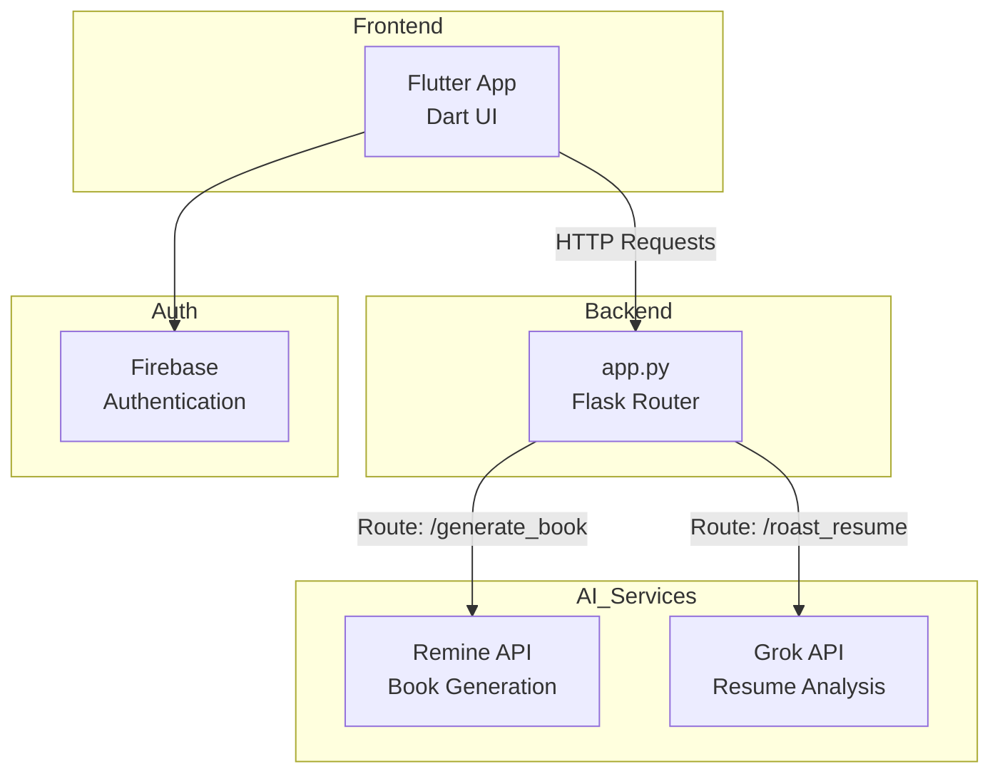
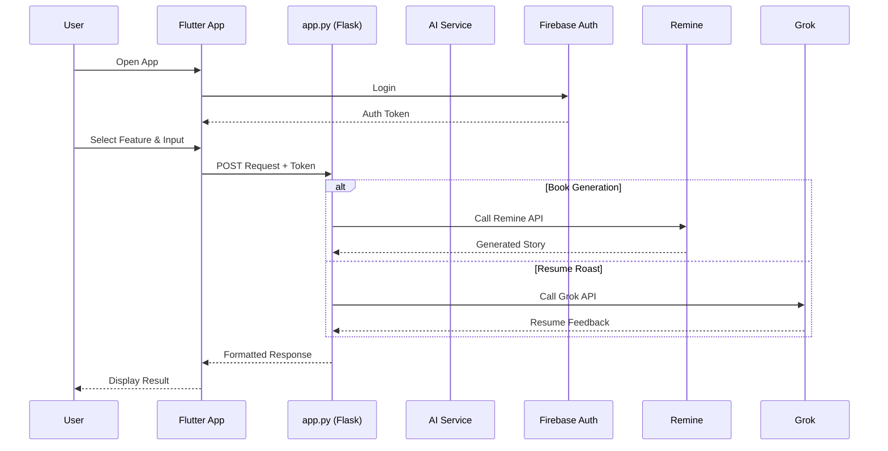
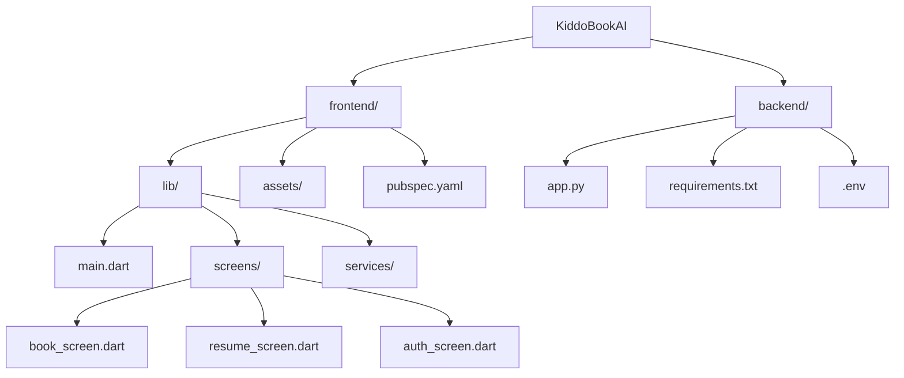
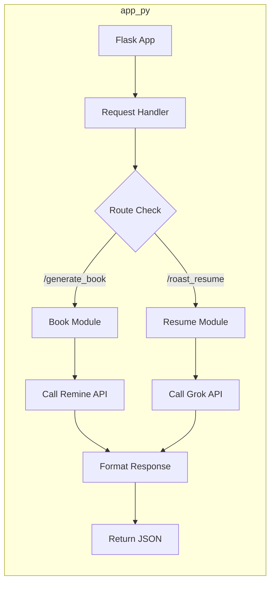
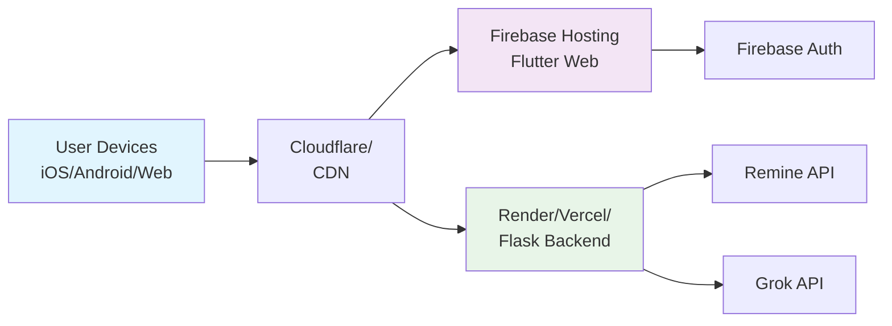
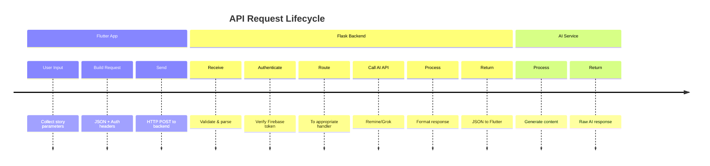
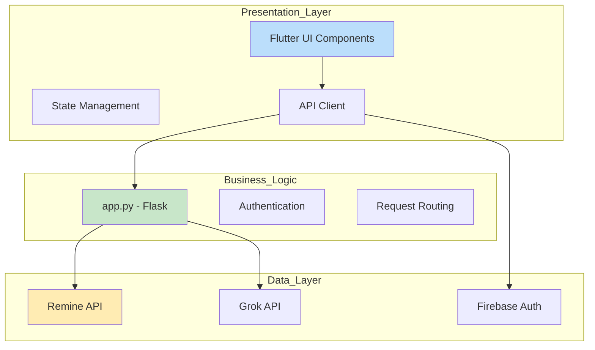
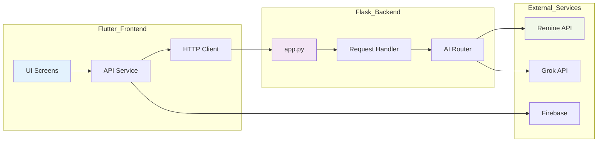

# KiddoBookAI

KiddoBookAI is a playful AI-powered platform with Flutter frontend and minimalist Flask backend.  
Generate custom children's stories or get AI-powered resume feedback - all with a clean, modular design.

---

## Features

- **AI Children's Book Generation** using Remine API
- **AI Resume Roast** using Grok API  
- **Firebase Authentication** (Email & OAuth)
- **Kid-friendly Flutter Interface**
- **Lightweight Flask Backend**

---

## 🏗️ System Architecture



---

## 🔄 Data Flow Sequence



---

## 📁 Project Structure



---

## 🎯 Backend Architecture



---

## 🛠️ Backend Code Structure

```python
# app.py - Complete Backend
├── Flask App Setup
│   ├── CORS configuration
│   ├── Route definitions
│   └── Error handlers
├── Authentication Middleware
│   ├── Firebase token verification
│   └── User validation
├── Book Generation Route (/generate_book)
│   ├── Input validation
│   ├── Remine API call
│   ├── Response formatting
│   └── Error handling
├── Resume Roast Route (/roast_resume)
│   ├── Resume text processing
│   ├── Grok API call
│   ├── Feedback structuring
│   └── Error handling
└── Utility Functions
    ├── API key management
    ├── Rate limiting
    └── Logging
```

## 🚀 Deployment Architecture



---

## 🔄 Request-Response Flow



---

## 🏗️ Component Architecture



## 🎨 Frontend-Backend Integration



---

## Technology Stack

### 🎯 Frontend Layer
- **Flutter 3.x** - Cross-platform framework
- **Dart** - Programming language
- **Firebase Auth** - Authentication service
- **HTTP Client** - API communication

### ⚙️ Backend Layer  
- **Python Flask** - Micro web framework
- **Firebase Admin SDK** - Token verification
- **Requests** - HTTP library for API calls

### 🤖 AI Services Layer
- **Remine API** - Children's story generation
- **Grok API** - Resume analysis and feedback

### 🔧 Development Tools
- **Postman** - API testing
- **Git** - Version control
- **VS Code** - Development environment

---

## Quick Start

1. **Clone the repository:**
```bash
git clone https://github.com/yourusername/kiddobookai.git
cd kiddobookai
```

2. **Backend setup:**
```bash
cd backend
pip install -r requirements.txt
python app.py
```

3. **Frontend setup:**
```bash
cd frontend
flutter pub get
flutter run
```

---

## API Configuration

Add your API keys to `.env` file:
```env
REMINES_API_KEY=your_remine_key_here
GROK_API_KEY=your_grok_key_here
FIREBASE_CREDENTIALS=path/to/firebase.json
```

---

## 📞 Support

For issues or questions:
1. Check existing GitHub issues
2. Create new issue with detailed description
3. Email: dronabocphe@gmail.com

---

## 📄 License

MIT License - see LICENSE file for details.

---

## 👨‍💻 Author

**Drona**  
*Building playful AI experiences for everyone*  
[GitHub](https://github.com/yourusername) | [Portfolio](https://drona.dev)

---
```
<div align="center">
  
**"Where children's creativity meets professional growth"**

</div>
```
