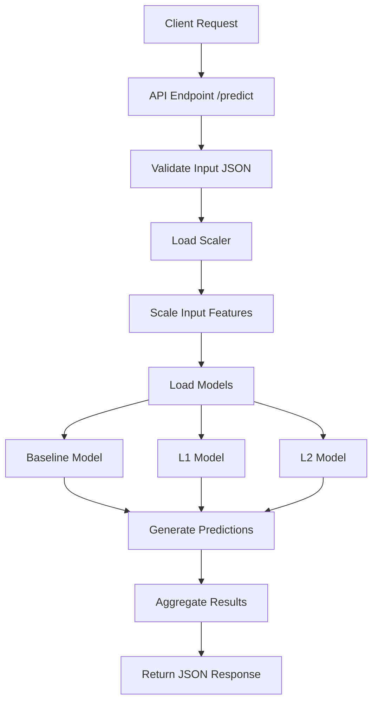
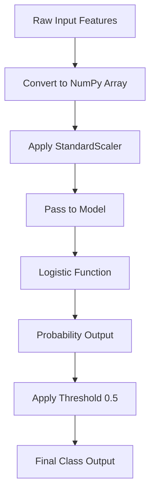
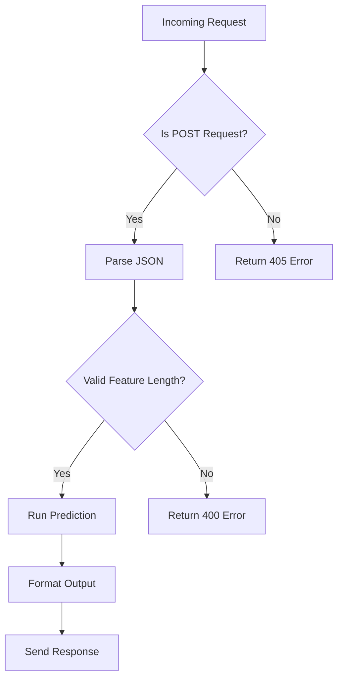

# 👥 Employee Turnover Prediction Analysis


## 1. System Overview

This document defines the API architecture, request flow, and system-level design for the Employee Turnover Prediction project. The system exposes a prediction endpoint that accepts employee-related features and returns predictions from three models:

* Baseline Logistic Regression
* L1 Regularized Logistic Regression (Lasso)
* L2 Regularized Logistic Regression (Ridge)

All models are pre-trained and loaded at runtime.

---

## 2. Folder Structure

```
Employee-Turnover-Prediction/
│
├── data/
│   └── employee_turnover.csv
│
├── models/
│   ├── baseline_model.pkl
│   ├── l1_model.pkl
│   ├── l2_model.pkl
│   └── scaler.pkl
│
├── src/
│   ├── preprocessing.py
│   ├── predict.py
│   └── utils.py
│
├── api/
│   └── app.py
│
├── notebooks/
│   └── Employee_Turnover_Analysis.ipynb
│
├── requirements.txt
└── README.md
```

---

## 3. API Design

### Endpoint

```
POST /predict
```

### Request Body (JSON)

```
{
  "features": [0.56, 0.14, 0.12, 0.78, 0.33, 50000, 3, 35, 2, 1, 10000, 20, 2, 100000000, 200000]
}
```

### Response

```
{
  "baseline_prediction": 0,
  "l1_prediction": 0,
  "l2_prediction": 0,
  "confidence": {
    "baseline": 0.89,
    "l1": 0.90,
    "l2": 0.89
  }
}
```

---

## 4. Flowchart 1: End-to-End Prediction Flow



---

## 5. Flowchart 2: Internal Model Prediction Pipeline



---

## 6. Flowchart 3: API Request Handling Logic



## 8. Model Performance Summary

All models demonstrate strong predictive capability with approximately 89% confidence levels across predictions.

| Model      | Accuracy | F1 Score | AUC  |
| ---------- | -------- | -------- | ---- |
| Baseline   | ~0.89    | High     | 0.94 |
| L1 (Lasso) | ~0.89+   | Best     | 0.94 |
| L2 (Ridge) | ~0.89    | Stable   | 0.94 |

---

## 9. Design Considerations

* Standardization is mandatory due to regularization sensitivity
* L1 model provides feature sparsity
* L2 model ensures coefficient stability
* API designed for low latency inference

