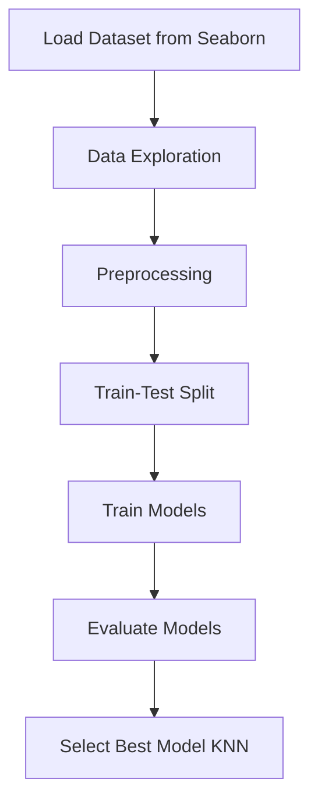
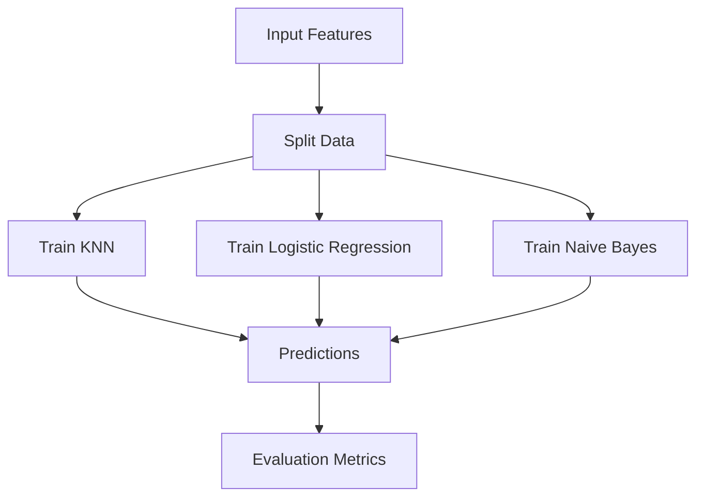
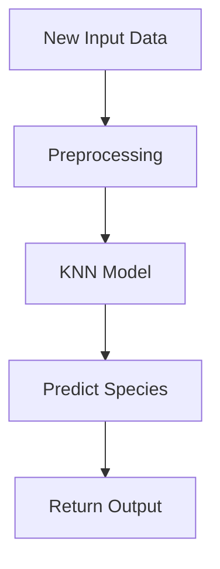

# Iris Flower Prediction Analysis

## 1. Project Overview

This project focuses on predicting iris flower species using classical machine learning algorithms. The dataset is directly imported from Seaborn using `sns.load_dataset('iris')`, making the workflow lightweight and reproducible.


Multiple models were trained and evaluated, including:

* K-Nearest Neighbors (KNN)
* Logistic Regression
* Naive Bayes

All models achieved perfect performance on the dataset. However, KNN is selected as the primary model for this project.

---

## 2. Objectives

* Load and explore the Iris dataset from Seaborn
* Train multiple classification models
* Evaluate using standard classification metrics
* Compare models and select the best one
* Present a clean and interpretable pipeline

---

## 3. Dataset Information

* **Source:** Seaborn (`sns.load_dataset`)
* **Dataset Name:** Iris
* **Target Variable:** `species`
* **Classes:**

  * setosa
  * versicolor
  * virginica
* **Features:**

  * sepal_length
  * sepal_width
  * petal_length
  * petal_width

The dataset is clean, balanced, and requires minimal preprocessing.

---

## 4. Technologies Used

* Python
* NumPy
* Pandas
* Matplotlib
* Seaborn
* Scikit-learn
* Jupyter Notebook

---

## 5. Data Preprocessing

* Loaded dataset using Seaborn
* Checked for missing values (none found)
* Encoded target labels if required
* Train-test split applied
* Feature scaling applied where necessary

---

## 6. Models Implemented

### K-Nearest Neighbors (KNN)

* Distance-based algorithm
* Performs well on small, well-separated datasets
* Selected as final model

### Logistic Regression

* Linear decision boundary
* Works effectively for separable classes

### Naive Bayes

* Probabilistic classifier
* Assumes feature independence

---

## 7. Evaluation Metrics

All models were evaluated using:

* Accuracy
* Precision
* Recall
* F1 Score
* R2 Score

---

## 8. Performance Summary

| Model               | Accuracy | Precision | Recall | F1 Score | R2 Score |
| ------------------- | -------- | --------- | ------ | -------- | -------- |
| KNN                 | 100%     | 100%      | 100%   | 100%     | 100%     |
| Logistic Regression | 100%     | 100%      | 100%   | 100%     | 100%     |
| Naive Bayes         | 100%     | 100%      | 100%   | 100%     | 100%     |

All models achieve perfect classification due to the highly separable nature of the Iris dataset.

---

## 9. Flowchart 1: End-to-End Pipeline



---

## 10. Flowchart 2: Model Training Flow



---

## 11. Flowchart 3: Prediction Flow



---

## 12. Model Selection Insight

Although all models achieved 100% accuracy, KNN is selected because:

* It is simple and non-parametric
* Performs exceptionally well on this dataset
* Captures local decision boundaries effectively

---

## 13. Folder Structure

```
Iris-Flower-Prediction/
│
├── data/
│
├── models/
│   ├── knn_model.pkl
│   ├── logistic_model.pkl
│   └── naive_bayes_model.pkl
│
├── notebooks/
│   └── iris_analysis.ipynb
│
├── src/
│   ├── preprocessing.py
│   └── train.py
│
├── requirements.txt
└── README.md
```

## 14. Author

Cherry
Machine Learning Enthusiast
