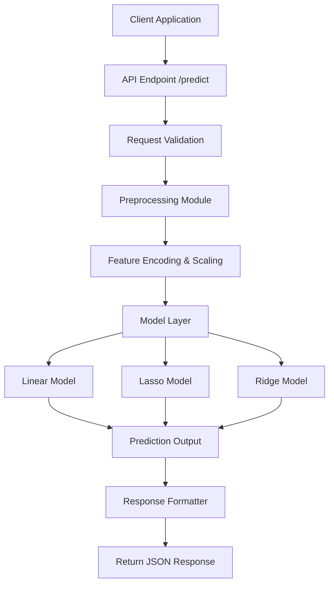
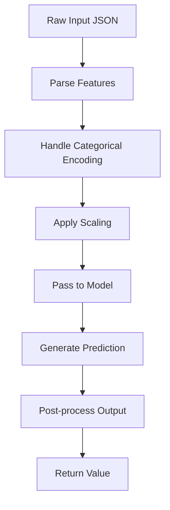
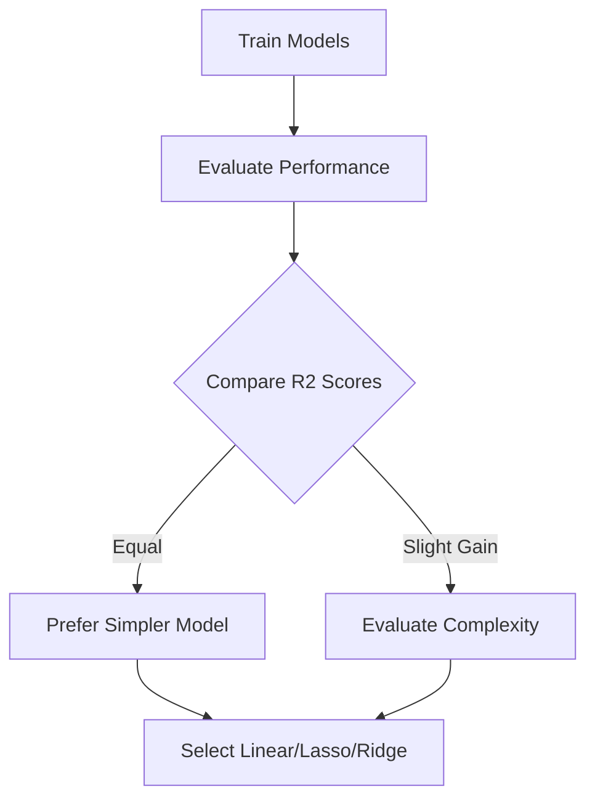

# Medical Cost Prediction (Insurance Charges)

## 1. Project Overview

This project predicts individual medical insurance charges using structured demographic and health-related features. The dataset is sourced from Kaggle and is clean, enabling a streamlined pipeline from exploration to model training and evaluation.

Primary models used:

* Linear Regression (Baseline)
* L1 Regularization (Lasso)
* L2 Regularization (Ridge)

A tree-based CatBoost model was also evaluated for comparison.

---

## 2. Objectives

* Analyze medical insurance data and relationships between features and charges
* Build regression models for cost prediction
* Compare linear models with regularization
* Evaluate performance using regression metrics
* Design a backend-oriented prediction flow (API-centric)

---

## 3. Dataset Information

* **Source:** Kaggle (Medical Insurance Dataset)
* **Target Variable:** `charges`
* **Features:**

  * age
  * sex
  * bmi
  * children
  * smoker
  * region

Dataset is clean with no missing values.

## 5. Exploratory Data Analysis (EDA)

* Distribution plots for `charges`
* Correlation heatmap
* BMI vs Charges scatter plots
* Smoker vs Charges comparison
* Category mapping for encoding

Insights:

* Smoking status strongly impacts charges
* BMI and age show positive correlation with cost

---

## 6. Data Preprocessing

* Encoding categorical variables (sex, smoker, region)
* Feature scaling for linear models
* Train-test split
* Feature-target separation

---

## 7. Models Implemented

### Linear Regression (Baseline)

* Establishes baseline performance

### L1 Regularization (Lasso)

* Reduces feature redundancy
* Performs implicit feature selection

### L2 Regularization (Ridge)

* Stabilizes coefficients
* Reduces overfitting

### CatBoost (Comparison Model)

* Gradient boosting technique
* Slight improvement observed

---

## 8. Evaluation Metrics

* R2 Score
* Mean Absolute Error (MAE)

---

## 9. Performance Summary

| Model             | R2 Score | MAE   |
| ----------------- | -------- | ----- |
| Linear Regression | 0.858    | 2759  |
| Lasso (L1)        | 0.858    | 2759  |
| Ridge (L2)        | 0.858    | 2759  |
| CatBoost          | 0.860    | ~2700 |

Observation: CatBoost provides marginal improvement, but linear models remain efficient and interpretable.

---

## 10. Backend Architecture Focus

The system is designed with a backend-first approach where an API endpoint handles prediction requests and returns computed insurance charges.

---

## 11. Flowchart 1: API Prediction Architecture



---

## 12. Flowchart 2: Internal Processing Pipeline



---

## 13. Flowchart 3: Model Selection Flow



---

## 14. Folder Structure

```
Medical-Cost-Prediction/
│
├── data/
│   └── insurance.csv
│
├── models/
│   ├── linear_model.pkl
│   ├── lasso_model.pkl
│   ├── ridge_model.pkl
│   └── scaler.pkl
│
├── src/
│   ├── preprocessing.py
│   ├── train.py
│   └── predict.py
│
├── notebooks/
│   └── medical_cost_analysis.ipynb
│
├── requirements.txt
└── README.md
```

## 15. Author

Cherry
Machine Learning Enthusiast

