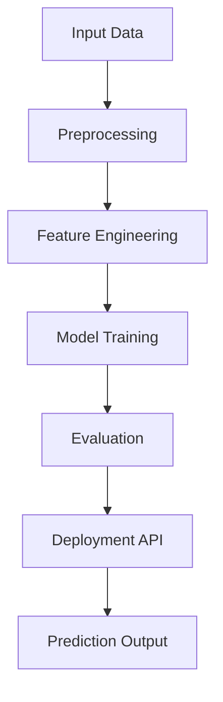
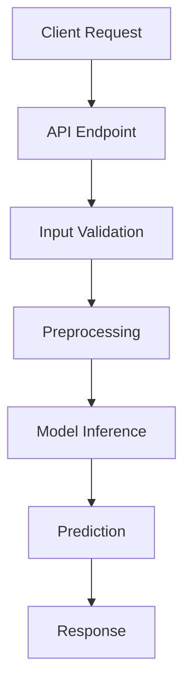

# ML_To_Train

A large-scale repository containing 100+ Machine Learning, Deep Learning, NLP, and Reinforcement Learning projects, built using a standardized and reusable architecture.


---

## Repository Overview


This repository is designed to provide a consistent and scalable structure for implementing machine learning systems across multiple domains. Each project is self-contained and includes dataset handling, preprocessing pipelines, model training, and deployment logic.


---

## Project Categorization

| Category                            | Range    | Description                                   | Projects                                                                                                                                                                                                                                                                                                                                                                                                                                                                                                                                                                                                                                                                                                                                                                                                                                                                                                                                                                                                                                                           |
| ----------------------------------- | -------- | --------------------------------------------- | ------------------------------------------------------------------------------------------------------------------------------------------------------------------------------------------------------------------------------------------------------------------------------------------------------------------------------------------------------------------------------------------------------------------------------------------------------------------------------------------------------------------------------------------------------------------------------------------------------------------------------------------------------------------------------------------------------------------------------------------------------------------------------------------------------------------------------------------------------------------------------------------------------------------------------------------------------------------------------------------------------------------------------------------------------------------ |
| **Supervised Learning**             | 01–29    | Regression and classification (tabular data)  | [01 House Price Prediction](./01_House_Price_Predict)<br>[02 Employee Retention Prediction](./02_Employee_Retention_Prediction)<br>[03 Iris Flower Prediction](./03_Iris_Flower_Predictor)<br>[04 Medical Cost Filter](./04_Medical_Cost_Fliter)<br>[05 Titanic Survival Prediction](./05_Titanic_Survival)<br>[06 Email Spam Classification](./06_Email_Spam_Classification)<br>[07 Energy Power Prediction](./07_Energy_Power_Predictor)<br>[08 Smart Shop Prediction](./08_SmartShop_pred)<br>[10 Used Car Price Prediction](./10_Used_Car_Price_Prediction)<br>[11 Mobile Price Range Prediction](./11_Mobile_Price_Range_Prediction)<br>[13 Hotel Booking Cancellation Prediction](./13_Hotel_Booking_Cancellation_Prediction)<br>[14 Crop Yield Prediction](./14_Crop_Yield_Prediction)<br>[17 Song Genre Prediction](./17_Song_Genre_Prediction)<br>[18 Password Strength Prediction](./18_Password_Strength_Prediction)<br>[19 Higher Health Risk Prediction](./19_Higher_Health_Risk_Pred)<br>[20 Personality Prediction](./20_Personality_Prediction_Post)<br>[21 Toxic Comment Filter](./21_Toxic_Comment_Filter)<br>[23 YouTube Video Popularity Prediction](./23_YouTube_Video_Popularity_Prediction)<br>[26 Credit Wise Loan Approval](./26_CreditWiseLoan_appoval)<br>[27 Amazon Product Price Determination](./27_Amazon_Product_Price_Determination)<br>[28 Customer Churn Prediction](./28_Customer_Churn_Prediction)<br>[29 Credit Card Fraud Detection](./29_Credit_Card_Fraud_Detection) |
| **Unsupervised Learning**           | 09,24–25 | Clustering, anomaly detection, topic modeling | [09 Smart Cart Clustering System](./09_SmartCart_Clustering_System)<br>[24 Anomaly Detection](./24_Anomaly_Detection)<br>[25 Document Topic Modelling](./25_Document_Topic_Modelling) |
| **Recommendation Systems**          | 22       | Personalized recommendation models            | [22 Movie Recommendation System](./22_Movies_Recommendation_System) |
| **Computer Vision & Deep Learning** | 12,30–39 | Image classification and vision models        | [12 Date Fruit Classification](./12_Date_Fruit_Classification)<br>[30 Binary Image Classification](./30_Binary_Image_Classification)<br>[31 Food Image Classification](./31_Food_Image_Classification)<br>[32 Image Class CIFAR10](./32_Image_Class_CIFAR10)<br>[33 MNIST Digit Classification](./33_MNIST_Digit_Classification)<br>[34 Human Activity Recognition](./34_Human_Activity_Recognition)<br>[35 Medical Image Segmentation](./35_Medical_Image_Segmentation)<br>[36 Object Detection using YOLO](./36_Object_Detection_YOLO)<br>[37 Face Recognition System](./37_Face_Recognition_System)<br>[38 Neural Style Transfer](./38_Neural_Style_Transfer)<br>[39 Video Action Recognition](./39_Video_Action_Recognition) |
| **Natural Language Processing**     | 15–16,40–49| Text analysis, classification and NLP pipelines| [15 Text Emotion Detection](./15_Text_Emotion_Detection)<br>[16 Country Development Chunk](./16_Country_Development_Chunk)<br>[40 Resume Keyword Extractor](./40_Resume_Keyword_Extractor)<br>[41 ATS Analyser](./41_ATS_analyser)<br>[42 Sentiment Analysis](./42_Sentiment_Analysis)<br>[43 Named Entity Recognition](./43_Named_Entity_Recognition)<br>[44 Machine Translation Seq2Seq](./44_Machine_Translation_Seq2Seq)<br>[45 Chatbot Intent Classification](./45_Chatbot_Intent_Classification)<br>[46 Phishing SMS Classifier](./46_Phishing_SMS_Classifier)<br>[47 Semantic Search Engine](./47_Semantic_Search_Engine)<br>[48 Keyword Extractor using KeyBERT](./48_Keyword_Extractor)<br>[49 Topic Modeling with BERTopic](./49_BERTopic_Modeling) |
| **Generative AI & Multimodal**       | 50–59,87 | Text, image, and multimodal generation systems | [50 Next Token Prediction](./50_Next-Token_Prediction)<br>[51 Text Generator](./51_Text_Generator)<br>[52 Prefix Tree Autocomplete Engine](./52_Prefix-Tree_AutoComplete_Engine)<br>[53 Text Summariser](./53_Text_Summariser)<br>[54 Text Classification](./54_Text_classification)<br>[55 Language Translation](./55_Language_Translation)<br>[56 RAG Injection Research Pipeline](./56_RAG_Injection_Research_Pipeline)<br>[57 Text-to-SQL Generator](./57_Text_to_SQL_Generator)<br>[58 Visual Question Answering](./58_Visual_QA_Multimodal)<br>[59 Code Autocomplete Assistant](./59_Code_Autocomplete_Assistant)<br>[87 Image Generation System](./87_Generate_Images) |
| **Conversational AI & Chatbots**    | 60–69    | Rule-based, voice, and AI-powered chat systems | [60 Legal Chatbot](./60_LegalEase_ChatBot)<br>[61 Rule-Based FAQ System](./61_Rule-Based_FAQ)<br>[62 Mental Health Support Bot](./62_Mental_Health_Support_Bot)<br>[63 E-Commerce Recommendation Chatbot](./63_Ecomm_Recommendation_Chatbot)<br>[64 Healthcare Assistant Bot](./64_Healthcare_Assistant_Bot)<br>[65 Voice-to-Text Chatbot](./65_Voice_To_Text_Chatbot)<br>[66 Voice Number Normalization](./66_Voice_Number_Normalization)<br>[67 Customer Support Routing Bot](./67_Support_Routing_Agent)<br>[68 Voice Command Control](./68_Voice_Command_Control)<br>[69 Language Tutor Conversational Bot](./69_Language_Tutor_Bot) |
| **Time Series & Forecasting**       | 70,72–79 | Sequential and temporal data modeling         | [70 Stock Trend Predictor](./70_Stock_Trend_Predictor)<br>[72 Weather Temperature Forecast](./72_Weather_Temp_Forecast)<br>[73 Energy Demand Forecasting](./73_Energy_Demand_Forecasting)<br>[74 Financial Market Volatility Predictor](./74_Market_Volatility_Predictor)<br>[75 Sales Forecasting System](./75_Retail_Sales_Forecasting)<br>[76 Traffic Flow Predictor](./76_Traffic_Flow_Predictor)<br>[77 Predictive Maintenance Engine](./77_Predictive_Maintenance)<br>[78 Air Quality Index Forecaster](./78_AQI_Forecasting)<br>[79 Web Traffic Prediction](./79_Web_Traffic_Forecasting) |
| **Reinforcement Learning & Agents** | 71,80–86,88–100 | Agent-based learning, games, and environments | [71 Smart Ambulance Rapid Response](./71_Smart_Ambulance_RapidResponse)<br>[80 Flappy Bird Agent](./80_Flappy_bird_Agent)<br>[81 Mario Playing RL Agent](./81_Mario-playing_RL_Agent)<br>[82 Snake Game RL Agent](./82_Snake_Game_RL_Agent)<br>[83 Pong using Double DQN](./83_Pong_DDQN)<br>[84 Breakout using DQN](./84_Breakout_DQN)<br>[85 Maze Solver](./85_Maze_Solver_RL)<br>[86 AI Personal Agent](./86_AI_Personal_Agent)<br>[88 Agentic AI](./88_Agenti_AI)<br>[89 Tic-Tac-Toe Minimax vs RL](./89_TicTacToe_RL)<br>[90 Portfolio Optimization Agent](./90_Portfolio_Optimization_RL)<br>[91 Gridworld Pathfinder](./91_Gridworld_Pathfinder_RL)<br>[92 Autonomous Driving Lane Keeping](./92_Lane_Keeping_RL)<br>[93 Lunar Lander](./93_Lunar_Lander_RL)<br>[94 CartPole Balance Agent](./94_CartPole_Balance_RL)<br>[95 Supply Chain Inventory Agent](./95_Inventory_Control_RL)<br>[96 Smart Grid Power Dispatcher](./96_SmartGrid_Power_Dispatcher_RL)<br>[97 Traffic Light Control Optimizer](./97_Traffic_Light_Optimization_RL)<br>[98 Drone Navigation in 3D](./98_Drone_Navigation_RL)<br>[99 Multi-Agent Cooperative Pursuit](./99_MultiAgent_Cooperative_Pursuit)<br>[100 AI Web Scraping & Orchestrator Agent](./100_AI_Web_Orchestrator_Agent) |

---

## Standard Project Structure

```
Project_Name/
│
├── Dataset/
├── Models/
├── Resources/
├── SRC/
│   ├── Processing/
│   ├── Output/
│   └── App.py
│
├── Project_Notebook.ipynb
├── requirements.txt
└── README.md
```

| Directory / File    | Description                                 | Contents                                                                        |
| ------------------- | ------------------------------------------- | ------------------------------------------------------------------------------- |
| **Dataset/**        | Stores raw data for training and evaluation | CSV files, image datasets, structured tabular data                              |
| **Models/**         | Contains trained and serialized models      | `.pkl`, `.joblib`, `.h5`, saved pipelines                                       |
| **Resources/**      | Supporting assets for the project           | Diagrams, visualization images, documentation files                             |
| **SRC/**            | Core application logic                      | Complete ML pipeline implementation                                             |
| **SRC/App.py**      | Entry point of the application              | Handles input, preprocessing, model loading, inference, and prediction output   |
| **SRC/Processing/** | Data preprocessing module                   | Missing value handling, encoding, feature engineering, scaling, transformations |
| **SRC/Output/**     | Output handling module                      | Prediction results, probability scores, confidence levels, timestamps           |

---

## Machine Learning Pipeline


---

## API Flow



---

# Data Sources

Datasets used in the projects are primarily sourced from the following platforms.

| Platform               | Usage                                                    |
| ---------------------- | -------------------------------------------------------- |
| Kaggle                 | Tabular datasets, classification and regression datasets |
| Hugging Face Datasets  | NLP datasets, text emotion detection, sentiment analysis |
| Public ML Repositories | Image datasets and benchmarking datasets                 |

---

## Design Principles

* Modular architecture
* Reusable preprocessing pipelines
* Consistent API design
* Scalability across projects
* Ease of integration for new implementations

