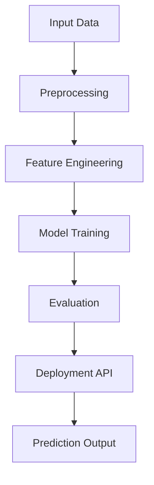
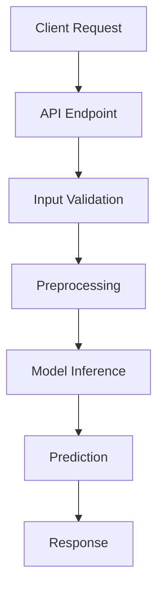

# ML_To_Train

A large-scale repository containing 100+ Machine Learning, Deep Learning, NLP, and Reinforcement Learning projects, built using a standardized and reusable architecture.


---

## Repository Overview


This repository is designed to provide a consistent and scalable structure for implementing machine learning systems across multiple domains. Each project is self-contained and includes dataset handling, preprocessing pipelines, model training, and deployment logic.


---

## Project Categorization

| Category                            | Range  | Description                                   | Projects                                                                                                                                                                                                                                                                                                                                                                                                                                                                                                                                                                                                                                                                                                                                                                                                                                                                                                                                                                                   |
| ----------------------------------- | ------ | --------------------------------------------- | ------------------------------------------------------------------------------------------------------------------------------------------------------------------------------------------------------------------------------------------------------------------------------------------------------------------------------------------------------------------------------------------------------------------------------------------------------------------------------------------------------------------------------------------------------------------------------------------------------------------------------------------------------------------------------------------------------------------------------------------------------------------------------------------------------------------------------------------------------------------------------------------------------------------------------------------------------------------------------------------ |
| **Supervised Learning**             | 01–30  | Regression and classification problems        | [01 House Price Prediction](./01_House_Price_Predict)<br>[02 Employee Retention Prediction](./02_Employee_Retention_Predict)<br>[03 Iris Flower Classification](./03_Iris_Classification)<br>[04 Medical Cost Prediction](./04_Medical_Cost_Predict)<br>[05 Titanic Survival Prediction](./05_Titanic_Survival)<br>[06 Email Spam Classification](./06_Email_Spam)<br>[07 Energy Power Prediction](./07_Energy_Predict)<br>[08 Smart Shop Prediction](./08_Smart_Shop)<br>[10 Used Car Price Prediction](./10_Car_Price_Predict)<br>[11 Mobile Price Range Prediction](./11_Mobile_Price_Predict)<br>[13 Hotel Booking Cancellation](./13_Hotel_Booking)<br>[14 Crop Yield Prediction](./14_Crop_Yield)<br>[19 Health Risk Prediction](./19_Health_Risk)<br>[20 Personality Prediction](./20_Personality)<br>[23 YouTube Video Popularity Prediction](./23_Youtube_Predict)<br>[26 Credit Loan Approval](./26_Loan_Approval)<br>[27 Amazon Product Price Determination](./27_Amazon_Price) |
| **Unsupervised Learning**           | 20–40  | Clustering, anomaly detection, topic modeling | [09 Smart Cart Clustering System](./09_Smart_Cart)<br>[22 Movie Recommendation System](./22_Movie_Recommendation)<br>[24 Anomaly Detection](./24_Anomaly_Detection)<br>[25 Document Topic Modelling](./25_Topic_Modeling)                                                                                                                                                                                                                                                                                                                                                                                                                                                                                                                                                                                                                                                                                                                                                                  |
| **Computer Vision & Deep Learning** | 30–40+ | CNNs and image-based tasks                    | [30 Binary Image Classification](./30_Binary_Image)<br>[31 Food Image Classification](./31_Food_Image)<br>[32 CIFAR-10 Classification](./32_CIFAR10)<br>[33 MNIST Digit Classification](./33_MNIST)<br>[12 Date Fruit Classification](./12_Date_Fruit)                                                                                                                                                                                                                                                                                                                                                                                                                                                                                                                                                                                                                                                                                                                                     |
| **NLP & Generative AI**             | 40–65  | Text processing and LLM-based systems         | [40 Resume Keyword Extractor](./40_Resume_Extractor)<br>[41 Sentiment Analysis](./41_Sentiment)<br>[50 Next Token Prediction](./50_Next_Token)<br>[51 Text Generator](./51_Text_Generator)<br>[52 Prefix Tree Autocomplete Engine](./52_Autocomplete)<br>[60 Legal Chatbot](./60_Legal_Chatbot)<br>[61 Rule-Based FAQ System](./61_FAQ_System)<br>[62 Mental Health Support Bot](./62_Mental_Health_Bot)<br>[65 Voice-to-Text Chatbot](./65_Voice_Chatbot)<br>[16 Text Emotion Detection](./16_Text_Emotion)<br>[17 Song Genre Prediction](./17_Song_Genre)<br>[18 Password Strength Prediction](./18_Password_Strength)                                                                                                                                                                                                                                                                                                                                                                   |
| **Time Series & Forecasting**       | 70–75  | Sequential data modeling                      | [70 Stock Trend Predictor](./70_Stock_Predict)<br>[72 Weather Temperature Forecast](./72_Weather_Forecast)                                                                                                                                                                                                                                                                                                                                                                                                                                                                                                                                                                                                                                                                                                                                                                                                                                                                                 |
| **Reinforcement Learning**          | 80–90  | Agent-based learning systems                  | [80 Flappy Bird Agent](./80_Flappy_Bird)<br>[81 Mario Playing RL Agent](./81_Mario_RL)<br>[83 Pong using Double DQN](./83_Pong_DDQN)<br>[84 Breakout using DQN](./84_Breakout_DQN)<br>[85 Maze Solver](./85_Maze_Solver)<br>[71 Smart Ambulance Rapid Response](./71_Ambulance_AI)<br>[86 AI Personal Agent](./86_AI_Agent)                                                                                                                                                                                                                                                                                                                                                                                                                                                                                                                                                                                                                                                                |
| **Generative & Advanced AI**        | 87+    | Advanced generative systems                   | [87 Image Generation System](./87_Image_Generation)                                                                                                                                                                                                                                                                                                                                                                                                                                                                                                                                                                                                                                                                                                                                                                                                                                                                                                                                        |

---

## Standard Project Structure

```
Project_Name/
│
├── Dataset/
├── Models/
├── Resources/
├── SRC/
│   ├── Processing/
│   ├── Output/
│   └── App.py
│
├── Project_Notebook.ipynb
├── requirements.txt
└── README.md
```

## Machine Learning Pipeline



---

## Project Structure

| Directory / File    | Description                                 | Contents                                                                        |
| ------------------- | ------------------------------------------- | ------------------------------------------------------------------------------- |
| **Dataset/**        | Stores raw data for training and evaluation | CSV files, image datasets, structured tabular data                              |
| **Models/**         | Contains trained and serialized models      | `.pkl`, `.joblib`, `.h5`, saved pipelines                                       |
| **Resources/**      | Supporting assets for the project           | Diagrams, visualization images, documentation files                             |
| **SRC/**            | Core application logic                      | Complete ML pipeline implementation                                             |
| **SRC/App.py**      | Entry point of the application              | Handles input, preprocessing, model loading, inference, and prediction output   |
| **SRC/Processing/** | Data preprocessing module                   | Missing value handling, encoding, feature engineering, scaling, transformations |
| **SRC/Output/**     | Output handling module                      | Prediction results, probability scores, confidence levels, timestamps           |


---

## API Flow



---

# Data Sources

Datasets used in the projects are primarily sourced from the following platforms.

| Platform               | Usage                                                    |
| ---------------------- | -------------------------------------------------------- |
| Kaggle                 | Tabular datasets, classification and regression datasets |
| Hugging Face Datasets  | NLP datasets, text emotion detection, sentiment analysis |
| Public ML Repositories | Image datasets and benchmarking datasets                 |

---

## Design Principles

* Modular architecture
* Reusable preprocessing pipelines
* Consistent API design
* Scalability across projects
* Ease of integration for new implementations

