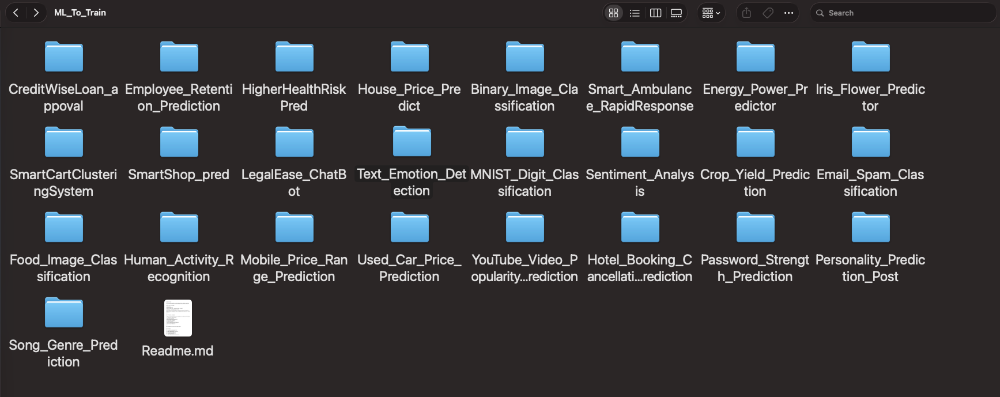
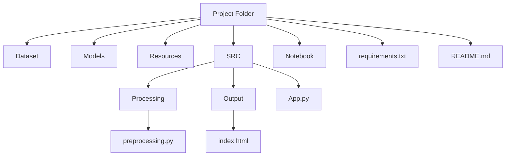
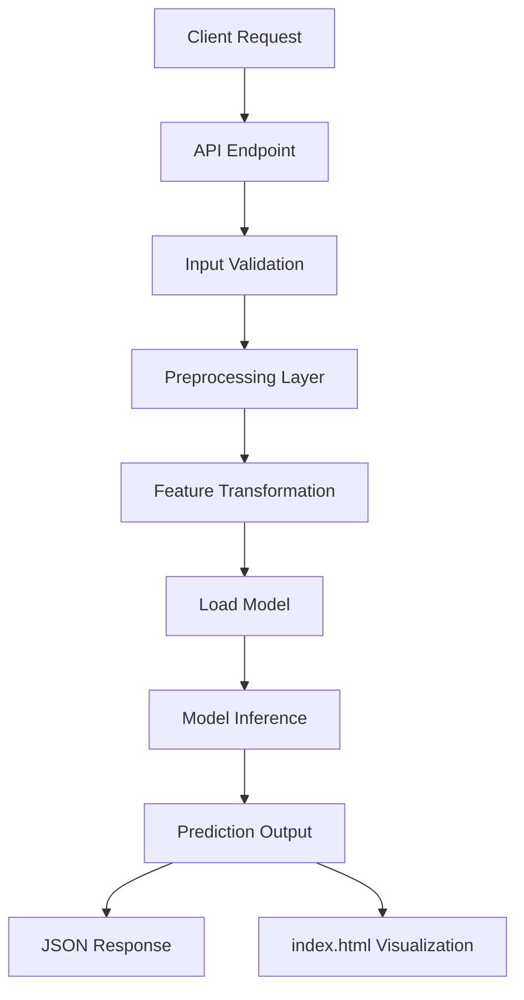

# ML_To_Train



A structured repository containing multiple Machine Learning projects organized using a consistent and reusable architecture.


Each project is self-contained and includes the dataset, trained model, preprocessing pipeline, API logic, and experimentation notebook. The goal of this repository is to maintain a standardized layout across all Machine Learning implementations, making the repository easier to maintain, extend, and understand.

---

# Repository Overview

The repository contains multiple Machine Learning projects spanning classification, regression, clustering, and NLP-based prediction systems.


## Projects Included

1. Binary Image Classification
2. Creditwise Loan Approval
3. Crop Yield Prediction
4. Email Spam Classification
5. Employee Retention
6. Energy Power Prediction
7. Food Image Classification
8. Heart Health Risk Predictor
9. Hotel Booking Cancellation Prediction
10. House Price Predictor
11. Human Activity Recognition
12. Iris Flower Predictor
13. Legally Chatbot
14. MNIST Digit Classification
15. Mobile Price Range Prediction
16. Password Strength Prediction
17. Personality Prediction
18. Post Sentiment Analysis
19. Smart Ambulance Rapid Response
20. Smart Car Clustering System
21. Smart Soap Prediction
22. Song Genre Prediction
23. Text Emotion Detection
24. Used Car Price Prediction
25. YouTube Video Popularity Prediction

---

# Repository Structure

```
ML_To_Train/
│
├── Binary_Image_Classification/
├── Creditwise_Loan_Approval/
├── Crop_Yield_Prediction/
├── Email_Spam_Classification/
├── Employee_Retention/
├── Energy_Power_Prediction/
├── Food_Image_Classification/
├── Heart_Health_Risk_Predictor/
├── Hotel_Booking_Cancellation_Prediction/
├── House_Price_Predictor/
├── Human_Activity_Recognition/
├── Iris_Flower_Predictor/
├── Legally_Chatbot/
├── MNIST_Digit_Classification/
├── Mobile_Price_Range_Prediction/
├── Password_Strength_Prediction/
├── Personality_Prediction/
├── Post_Sentiment_Analysis/
├── Smart_Ambulance_Rapid_Response/
├── Smart_Car_Clustering_System/
├── Smart_Soap_Prediction/
├── Song_Genre_Prediction/
├── Text_Emotion_Detection/
├── Used_Car_Price_Prediction/
└── YouTube_Video_Popularity_Prediction/
```

---

# Repository Architecture Flow

```mermaid
flowchart TD

A[ML_To_Train Repository]

A --> B1[Classification Projects]
A --> B2[Regression Projects]
A --> B3[Clustering Projects]
A --> B4[NLP Projects]

B1 --> C1[Binary Image Classification]
B1 --> C2[Email Spam Classification]
B1 --> C3[Heart Health Risk Predictor]
B1 --> C4[Iris Flower Predictor]
B1 --> C5[Food Image Classification]
B1 --> C6[Human Activity Recognition]
B1 --> C7[MNIST Digit Classification]

B2 --> D1[House Price Predictor]
B2 --> D2[Used Car Price Prediction]
B2 --> D3[Energy Power Prediction]
B2 --> D4[Crop Yield Prediction]
B2 --> D5[Mobile Price Range Prediction]
B2 --> D6[YouTube Video Popularity Prediction]

B3 --> E1[Smart Car Clustering System]

B4 --> F1[Post Sentiment Analysis]
B4 --> F2[Text Emotion Detection]
B4 --> F3[Song Genre Prediction]
B4 --> F4[Legally Chatbot]
B4 --> F5[Password Strength Prediction]
B4 --> F6[Personality Prediction]
```



---

# Standard Project Structure

Every Machine Learning project in this repository follows the same internal architecture.

```
Project_Name/
│
├── Dataset/
│   └── dataset files
│
├── Models/
│   └── trained model files
│
├── Resources/
│   └── project assets (images, diagrams, documentation files)
│
├── SRC/
│   │
│   ├── Output/
│   │   └── index.html
│   │
│   ├── Processing/
│   │   └── preprocessing.py
│   │
│   └── App.py
│
├── Project_Notebook.ipynb
├── requirements.txt
└── README.md
```

---

# Project Structure Flow



---

# Component Description

## Dataset

Contains the raw data used to train or evaluate the model.

Typical formats include:

* CSV
* Image datasets
* Structured tabular datasets

---

## Models

Stores serialized machine learning models.

Common formats include:

* .pkl
* .joblib
* .h5
* saved pipelines

---

## Resources

Contains supporting project files such as:

* diagrams
* visualization images
* additional documentation assets

---

## SRC

This directory contains the operational logic of the project.

### App.py

Acts as the entry point for the project API.

Responsibilities include:

* receiving input data
* calling preprocessing modules
* loading trained models
* performing inference
* returning predictions

---

### Processing

Contains all data preprocessing logic such as:

* missing value handling
* categorical encoding
* feature engineering
* feature scaling
* data transformation

---

### Output

Contains the interface used to display prediction results.

Typical output includes:

* prediction results
* probability scores
* model confidence
* timestamps

---

# API Pipeline Flow



---

# Data Sources

Datasets used in the projects are primarily sourced from the following platforms.

| Platform               | Usage                                                    |
| ---------------------- | -------------------------------------------------------- |
| Kaggle                 | Tabular datasets, classification and regression datasets |
| Hugging Face Datasets  | NLP datasets, text emotion detection, sentiment analysis |
| Public ML Repositories | Image datasets and benchmarking datasets                 |

---

# Design Philosophy

The repository follows a standardized architecture so that:

* every project remains self-contained
* models are easy to reuse
* preprocessing pipelines remain modular
* APIs remain consistent
* new projects can be integrated without structural changes


