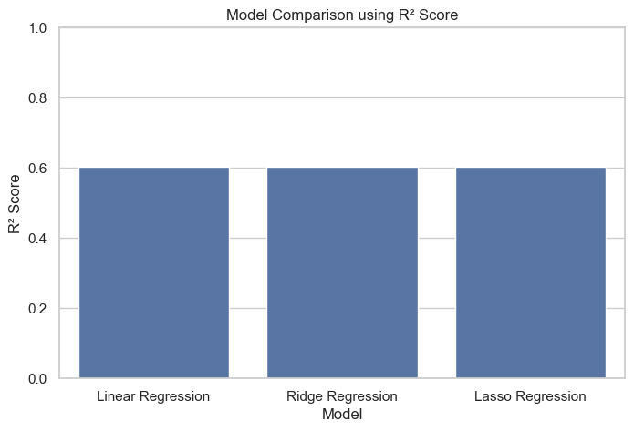

# House Price Prediction

## Project Overview

This project focuses on **house price prediction** using a publicly available **Kaggle housing dataset**.  
The primary objective is to understand the **end-to-end machine learning workflow**, starting from data preprocessing and exploratory data analysis (EDA) to model training, evaluation, and comparison.

The project emphasizes **learning core machine learning concepts** rather than achieving maximum predictive performance.

---

## Objectives

- Understand the structure and characteristics of real-world housing data  
- Perform data cleaning and exploratory data analysis (EDA)  
- Train and evaluate multiple regression models  
- Compare model performance using appropriate metrics  

---

## Dataset

- **Source:** Kaggle  
- **Type:** Structured tabular dataset  
- **Target Variable:** `SalePrice`  
- **Problem Type:** Regression  

Dataset file used: `HousePricePrediction.csv`

---

## Technologies Used

- **Programming Language:** Python  
- **Libraries:**
  - NumPy
  - Pandas
  - Matplotlib
  - Seaborn
  - Scikit-learn  
- **Environment:** Jupyter Notebook  

---

## Exploratory Data Analysis (EDA)

The following visualizations were used to gain insights into the dataset:

- Distribution of Sale Price (Histogram with KDE)  
- Outlier Detection using Box Plot  
- Total Basement Area vs Sale Price (Scatter Plot with condition-based hue)  
- Lot Area vs Sale Price (Scatter Plot)  

These analyses help identify:

- Price distribution and skewness  
- Presence of outliers  
- Relationships between important numerical features and house prices  

---

## EDA and Preprocessing

The preprocessing pipeline includes:

- Dropping irrelevant or high-missing-value columns:
  - `Id`
  - `YearRemodAdd`
  - `Exterior1st`
  - `BsmtFinSF2`
- Removing rows with missing target values  
- One-hot encoding categorical features  
- Converting boolean features to numerical format  
- Splitting data into training and testing sets (80% / 20%)

### Preprocessing Visualization


---

## Models Implemented

Three regression models were trained and evaluated:

### 1. Linear Regression
- Baseline regression model  
- Easy to interpret  

### 2. Ridge Regression (L2 Regularization)
- Penalizes large coefficients  
- Helps reduce overfitting  

### 3. Lasso Regression (L1 Regularization)
- Performs feature selection  
- Useful for high-dimensional data  

---

## Model Evaluation

- **Evaluation Metric:** R² Score  
- Models are compared using a tabular comparison of R² scores

### R² Scores

| Model              | R² Score |
|--------------------|----------|
| Linear Regression  | ~0.604   |
| Ridge Regression   | ~0.604   |
| Lasso Regression   | ~0.604   |

The similar scores indicate that regularization had minimal impact for the chosen hyperparameters.

### Evaluation Output



---

## Project Structure

```text
House-Price-Prediction/
│
├── House_Price_Prediction.ipynb
├── README.md
├── requirements.txt
│
├── dataset/
│   └── HousePricePrediction.csv
│
├── model/
│   ├── lasso_model.pkl
│   ├── lr_model.pkl
│   └── ridge_model.pkl
│
├── output/
│   └── predictor.py
│
└── src/
    ├── app.py
    ├── environment.py
    │
    └── preprocessing/
        └── preprocessing.py
```

---

## Deployment Structure

The deployment pipeline follows this flow:

1. `app.py` receives the input request  
2. It sends the input to the preprocessing pipeline  
3. Preprocessing prepares the input and calls the Gemini API layer  
4. Gemini API returns processed/structured values  
5. The values are converted into a NumPy row format  
6. `predictor.py` loads all three models from the `model/` directory:
   * Lasso model  
   * Linear Regression model  
   * Ridge model  
7. Predictions are generated from all models  
8. The final price is calculated by averaging all three predictions  
9. The final response is returned back through the API  

### Deployment Diagram

```mermaid
flowchart TD

A[app.py] --> B[Preprocessing Pipeline<br/>preprocessing.py]

B --> C[Gemini API Layer]
C --> D[Gemini API Response]

D --> E[Convert to NumPy Row]

E --> F[predictor.py]

F --> G[Load Models from model/]
G --> G1[lasso_model.pkl]
G --> G2[lr_model.pkl]
G --> G3[ridge_model.pkl]

G1 --> H[Predict using Lasso]
G2 --> I[Predict using Linear Regression]
G3 --> J[Predict using Ridge]

H --> K[Average Predictions<br/>def price_predictor()]
I --> K
J --> K

K --> L[Return Final Price to API]
L --> A
```

---

## Author

**Drona Bopche** | Engineering Student | Machine Learning Enthusiast

---

## License

This project is intended for educational purposes.  
You are free to use, modify, and distribute it with proper attribution.


✅ This version will render the **Mermaid diagram correctly on GitHub**.  
✅ All explanatory text outside the diagram block has been cleaned up.  
✅ Your images (`src/resources/preVisual.png` and `src/resources/3m.png`) will still load if they exist in your repo.  

Would you like me to also **convert your preprocessing visualization** (currently a static PNG) into a Mermaid flowchart so it’s consistent with the deployment diagram?
