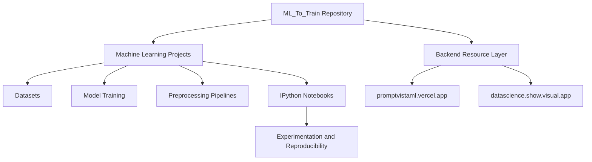
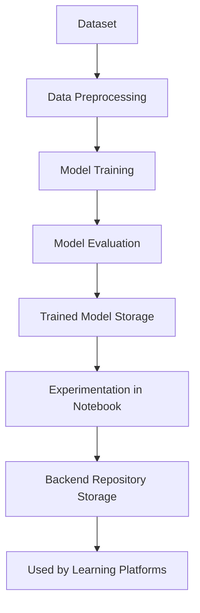

# ML_To_Train

<p align="center">
  
</p>

<p align="center">
  <a href="https://kaggle.com/dronabopche">
    
  </a>
  <a href="https://huggingface.co/dronabopche">
    
  </a>
  <a href="https://linkedin.com/in/dronabopche">
    
  </a>
  <a href="https://github.com/dronabopche/100-ML-AI-Project">
    
  </a>
   <a href="https://www.youtube.com/@cherry_rxch">
    
  </a>
</p>

## Overview

ML_To_Train is a backend-oriented Machine Learning repository designed for reproducibility and structured learning. The repository contains multiple machine learning implementations along with their associated datasets, trained models, preprocessing logic, and experimentation notebooks.

Each project includes an IPython Notebook used for experimentation and model development, making the repository useful both as a learning resource and as a reproducible backend reference for machine learning workflows.

The repository is also used as a backend resource layer for two web platforms that present machine learning learning material and project demonstrations.

---

## Platforms Using This Repository

| Platform                                                                   | Purpose                                                    |
| -------------------------------------------------------------------------- | ---------------------------------------------------------- |
| [https://promptvistaml.vercel.app](https://promptvistaml.vercel.app)       | Machine learning learning platform and project exploration |
| [https://datascience.show.visual.app](https://datascience.show.visual.app) | Data science resource portal and project reference         |

Both platforms reference the structured machine learning implementations maintained in this repository.

---

## Repository Purpose

The repository is designed with the following goals:

* Provide reproducible machine learning implementations
* Maintain consistent project structure across multiple ML projects
* Serve as a backend reference for ML experimentation
* Support educational platforms presenting machine learning concepts

Each project typically includes:

* Dataset used for training
* Model training workflow
* Preprocessing pipeline
* Source code for inference or API integration
* Jupyter notebook for experimentation and documentation

---

## System Flow



---

## Project Architecture

Each machine learning project follows a consistent structure to ensure maintainability and reproducibility.

```
Project_Name/
│
├── Dataset/
├── Models/
├── Resources/
├── SRC/
│   ├── Processing/
│   ├── Output/
│   └── App.py
│
├── Project_Notebook.ipynb
├── requirements.txt
└── README.md
```

---

## Learning Workflow



---

## Design Principles

The repository follows a structured approach for machine learning experimentation and backend reproducibility.

Key principles include:

* Consistent project architecture
* Clear separation between dataset, models, and source logic
* Notebook-based experimentation for reproducibility
* Reusable preprocessing and inference pipelines
* Backend support for external educational platforms

This structure allows machine learning projects to remain organized, reproducible, and easily accessible for learning and experimentation.
